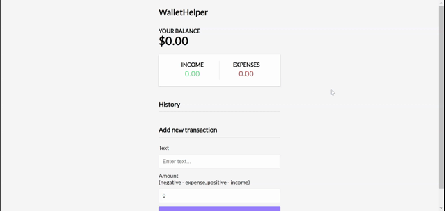

<h1 align="center">WalletHelper</h1> 
  <h2>Table of Contents<h2>
  <ul>
    <li>
     <a href="#description">Description</a>
    </li>
    <li>
      <a href="#demo">Demo</a>
    </li>
    <li>
      <a href="#instructions">Instructions</a>
    </li>
    <li>
      <a href="#tech">Technology</a>
    </li>
    <li>
      <a href="#license">License</a>
    </li>
    <li>
      <a href="#contributors">Contributors</a>
    </li>
  </ul>
    

  
<h2>Description</h2>

  
A React.js cashflow tracker to help you manage your money! Implements Context API for state.

  

  
<h2>Demo</h2>

  

  

  
<h2>Instructions</h2> 

  
Visit https://gregroyclark.github.io/wallet-helper/ and add your income & expenses.

  
  

  
  
<h2>Technology</h2>
           
  
 CSS, React.js

  
  

  
  
<h2>License</h2>

  

  
   
  

  
  
<h2>Contributors</h2>

  

    Github:
    <a href="https://github.com/gregroyclark/">
      https://github.com/gregroyclark/
    </a>
  
